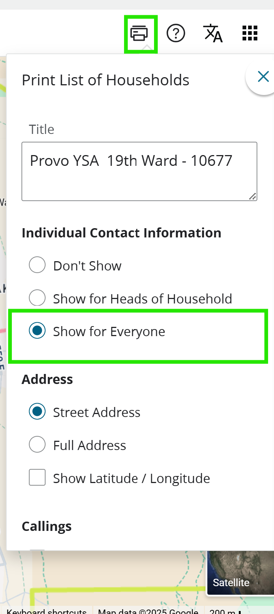
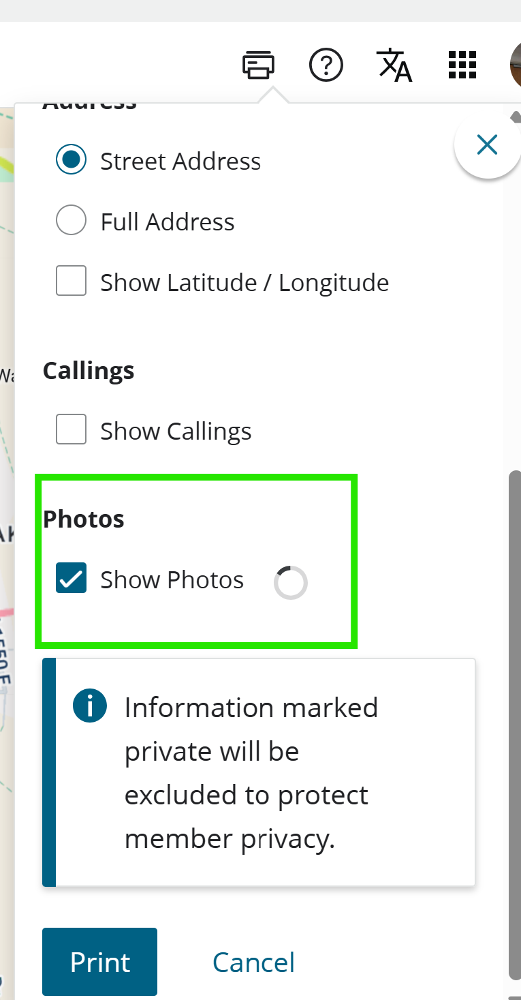
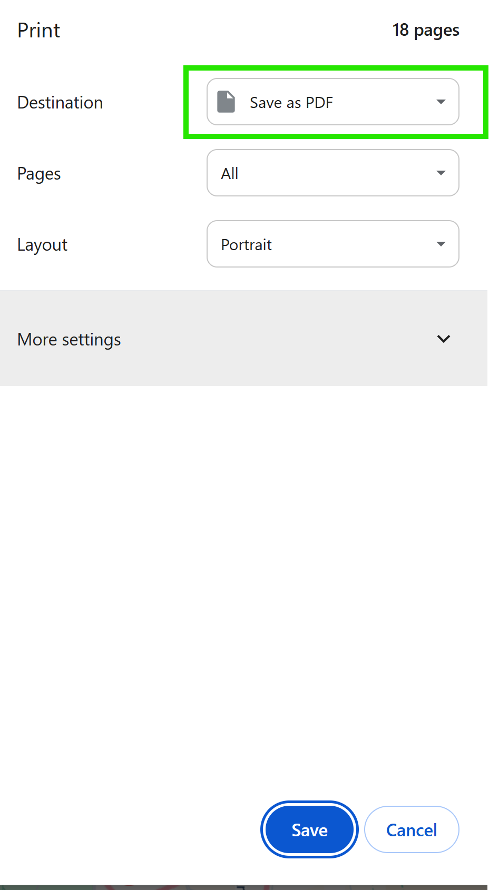

## NOTE:
- A laptop is preferable for using this project.
- This project is designed for compatibility with the [Anki](https://apps.ankiweb.net/) software. Download on your phone or laptop!
- This project can *only* be used at https://colab.research.google.com/github/code-for-neighborhood-needs/make_name_flashcards/blob/main/main.ipynb
- DO NOT CLICK "Run All". It will mess with how the download works. Follow instructions below.
# Instructions:

1. Go to https://directory.churchofjesuschrist.org/
2. Go to the top right corner, click the 🖨️ Printer symbol, and under "Individual Contact Information", click "Show for Everyone". This will make the next step possible.
3. Scroll down to "Photo" and click "Show Photos."
4. Click "Print".
5. On the print screen, instead of printing to a printer, click "Save to PDF" and print it.
6. Rename that pdf "ward_directory.pdf".
7. Upload it to this project.
8. Click "▶" on the first cell.
9. You should have a zip file now, with the following:
    - an Anki file that, when clicked, will import your flashcard set to Anki on your computer. It can also be imported to your phone if you send the file to your phone.
    - a pdf for making physical flashcards.
    - a tsv file with the raw file used to make the flashcard set.
    - the images associated with the tsv file.
10. If you would like to re-run the system for more files, and you find it is giving you bugs, trying running "▶" on the second cell.


<p align="center">
  

  

  
</p>


---
---
### Ideas for using the .tsv and image files:

The suggestions below are generated by ChatGPT:

---
---

Here’s how you can turn your “images-in-an images/ folder + CSV with ``” setup into live, shareable flashcards—with minimal re-hosting or manual uploads:

---

## 1. Anki (Desktop + AnkiWeb sync)

**Why?**
Anki is the gold-standard SRS flashcard app, and its desktop client lets you import a CSV **plus** all the media in one go.

**How:**

1. **Prepare your files**

   * Put your `cards.csv` (tab- or comma-separated) next to an `images/` directory containing exactly the PNGs you reference.
2. **Import into Anki desktop**

   * File → Import → select your CSV.
   * In the dialog, map “Front” and “Back” fields, check “Allow HTML in fields,” and point “Media folder” to the folder containing your `images/`.
3. **Review & Sync**

   * Once cards look right on desktop, click Sync to upload both cards and media to your AnkiWeb account.
   * Now you can study on any device running AnkiMobile or AnkiWeb.

---

## 2. RemNote (Web + Desktop App)

**Why?**
RemNote supports simple CSV imports with HTML image tags and will automatically upload any images you include.

**How:**

1. **Zip and upload**

   * Create a ZIP containing your CSV and the `images/` folder.
2. **Import**

   * In RemNote, go to “Import” → “Flashcards” → upload the ZIP.
   * Choose the field separator (tab/comma) and confirm “Import HTML” so it picks up your `` tags.
3. **Tag & Organize**

   * RemNote will generate a new document with each row as a flashcard; images will appear inline.

---

## 3. Quizlet (Web)

**Why?**
Quizlet’s “Import from file” feature can take term-URL pairs—so if you host your images somewhere public, you can bulk-import.

**How:**

1. **Host your images**

   * Upload your entire `images/` folder to a free host (e.g. Imgur album, GitHub Pages, or Google Drive public folder).
2. **Convert CSV to two-column**

   * Column A: Front term (e.g. “Britlin”)
   * Column B: Full URL to image (e.g. `https://…/001_1.png`) plus comma plus back text:

     ```
     https://…/001_1.png,Alius, Britlin
     ```
3. **Import**

   * In Quizlet: Create set → Import from Word, Excel, Google Docs → paste your two-column data → Finish.
   * Quizlet will render the image on the back and the text afterwards.

---

## 4. Cram, Brainscape, Chegg Prep

All three let you bulk-import via CSV with an “Image URL” column:

* **Cram.com**

  * CSV columns: Term, Definition, Image URL
  * Upload images somewhere public, point your URLs there in the CSV, then use Cram’s “Import” tool.
* **Brainscape**

  * Similar CSV approach; their bulk importer will fetch your images and attach them.
* **Chegg Prep**

  * Under “Create flashcards,” choose “Import,” map columns (including Image URL), and upload.

---

## 5. Build a Simple Static Site (Self-Hosted)

If you prefer fully offline or on your own server, you can use a tiny JavaScript library:

1. **flashcards.csv** + **images/** folder in same directory.
2. Use a script like [jQuery-CSV](https://github.com/evanplaice/jquery-csv) + a minimal Flashcard UI (e.g. [Flashcard.js](https://github.com/jimpick/flashcard)) to:

   ```html
   <script src="jquery.js"></script>
   <script src="jquery.csv.js"></script>
   <script src="flashcard.js"></script>
   <script>
     $.get('flashcards.csv', csv => {
       let data = $.csv.toObjects(csv);
       Flashcard.init(data, {
         frontField: 'Front',
         backHTMLField: 'Back'
       });
     });
   </script>
   ```
3. Open the HTML file in any browser—no uploads required.

---

## Quick Comparison

| Tool                      | Direct local-media import | Needs image hosting | SRS-powered | Mobile apps  |
| ------------------------- | ------------------------- | ------------------- | ----------- | ------------ |
| **Anki**                  | ✅ desktop “Media folder”  | –                   | ✅           | ✅ (via sync) |
| **RemNote**               | ✅ ZIP upload              | –                   | ✅           | ✅            |
| **Quizlet**               | –                         | ✅ public URLs       | ✓ (basic)   | ✅            |
| **Cram/Brainscape/Chegg** | –                         | ✅ public URLs       | ✓ (basic)   | ✅            |
| **Static site**           | ✅ local folder            | –                   | ✗ (manual)  | ✅ (PWA)      |

---

**Which to pick?**

* If you want **full SRS** and local-media ease: use **Anki**.
* If you prefer a **fully web-based workflow** with minimal config: try **RemNote**.
* If you need **collaboration/sharing** with quizzing modes: host your images and bulk-import into **Quizlet** or **Cram**.

